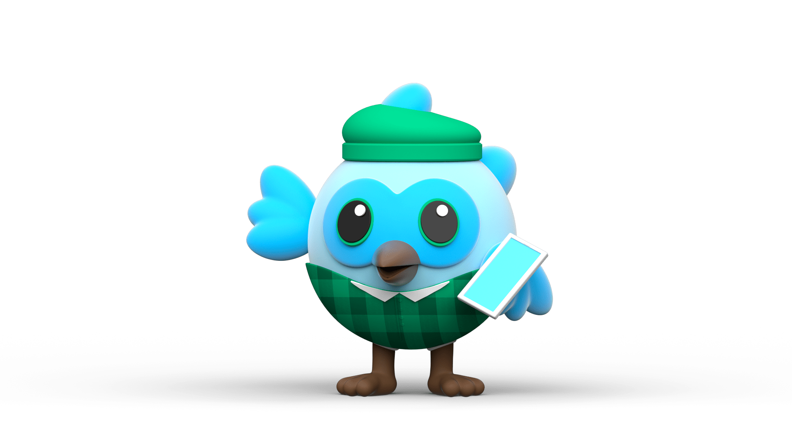

<h1 align="center">Hi there! I am Urmil</h1>

 

## About

I am Urmil Rupareliya. I am a third-year undergraduate student at Saurashtra University. I am amongst the top contributors in [Github](https://commits.top/india.html) from India. I am an aspiring Junior Android Developer at [Flopcoders](https://flopcoders.com/), presently leading the [Flopcoders Team](https://www.flopcoders.com/team) as the President, one of the Core Team Member of [Flopcoders](https://www.flopcoders.com) and Android Engineer Lead at [IoT Lab](http://www.lidstack.in). My other interests aside from Machine Learning are Backend Development, Cyber Security and Flutter.

 
 

	
	
	
	
  	
  	

## Timeline

- Core Team Member, DSC Ahmadabad (September 2020 - Present)
- Backend Developer, Presence (August 2019 - Present)

### Languages and Tools:

 
 
<code></code>
<code></code>
<code></code>
<code></code>
<code></code>
<code></code>
<code></code>
<code></code>
<code></code>
<code></code>
<code></code>
<code></code>
<code></code>
<code></code>
<code></code>

 

 

## 🔭 I’m currently working on

- Android IoT Projects
- OpenCv and shell scriptiong
- Kotlin and Flutter projects

 
 

## 🌱 I’m currently learning

- I am exploring and learning more things in the domain of Cyber Security Learning with [Cybrary](https://www.cybrary.it). I have some experience with Python and Android Development. I am focusing more to do end to end projects on Android IoT and Automation.

- Engaged in some projects in the domain of Python,Android Development, Backend Development and Flutter. You can find my work [here](https://github.com/urmil89?tab=repositories).

 

## 👯 I’m looking to collaborate on

- For doing projects on **Computer Vision (especially on Home Science)**.
- For doing **Research Papers**.
- For doing projects related to **TF-Lite**.
- For **Flutter/Android** Projects.

## Github Stats

 
 

  

  <g-emoji class="g-emoji" alias="chart_with_upwards_trend" fallback-src="https://github.githubassets.com/images/icons/emoji/unicode/1f4c8.png">📈</g-emoji>
  <strong>Github Stats : </strong>

 

  

  
  

 
 

### Show some ❤️ by starring some of the repositories!

